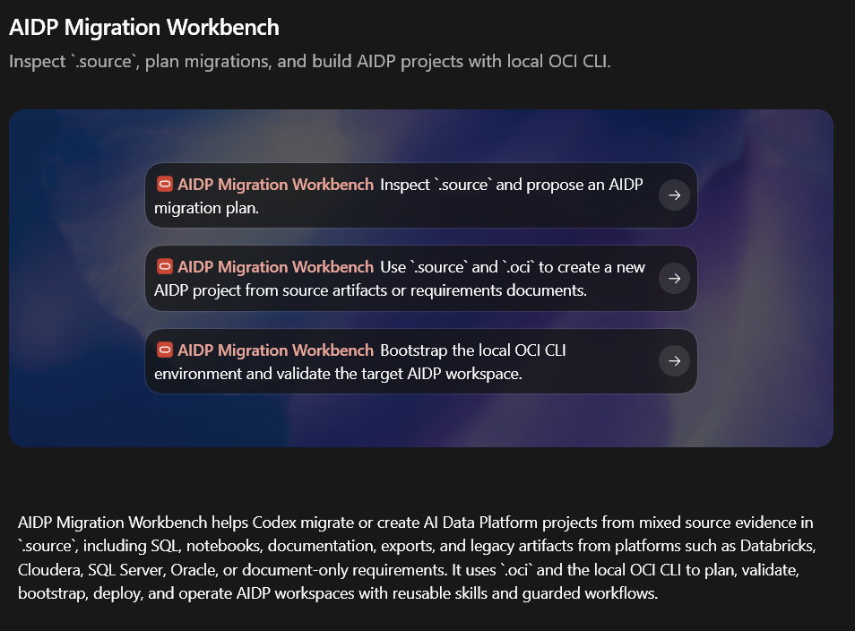

# AIDP Migration Workbench for Codex

Codex marketplace repository for installing the `oci-cli-workbench` plugin,
shown in Codex as **AIDP Migration Workbench**. The plugin helps Codex inspect
`.source` evidence, plan migrations, bootstrap local OCI CLI tooling, validate
AIDP runtime state, deploy Workbench assets, and operate medallion-style AIDP
projects.



## Install From GitHub

Users can add the marketplace with any of these forms:

```powershell
codex plugin marketplace add jgangini/codex-plugin-oci-aidp-migration-workbench
codex plugin marketplace add jgangini/codex-plugin-oci-aidp-migration-workbench@v0.1.10
codex plugin marketplace add https://github.com/jgangini/codex-plugin-oci-aidp-migration-workbench.git
```

For local testing before publishing:

```powershell
git clone https://github.com/jgangini/codex-plugin-oci-aidp-migration-workbench.git
cd codex-plugin-oci-aidp-migration-workbench
codex plugin marketplace add .
```

Then open Codex, find **AIDP Migration Workbench** in the plugin list, install
it if needed, and start a new thread so the plugin skills are loaded.

## Upgrade

```powershell
codex plugin marketplace upgrade oci-aidp-migration-workbench
```

Pinned installs can be upgraded by changing the Git ref, for example from a
tag to `main` or from `v0.1.10` to a newer release tag.

## Marketplace Layout

The marketplace entry lives at:

```text
.agents/plugins/marketplace.json
```

It exposes one plugin:

```text
plugins/oci-cli-workbench
```

The marketplace source path is intentionally relative:

```json
"path": "./plugins/oci-cli-workbench"
```

That keeps installation flexible across GitHub shorthand, HTTPS Git URLs, SSH
Git URLs, pinned refs, and local clone workflows.

## Skills

- `oci-bootstrap-uv`: bootstrap and repair the local Python/uv OCI CLI toolchain.
- `aidp-source-intake`: inspect `.source` and infer migration scope.
- `aidp-source-manifest`: build and validate the medallion migration manifest.
- `aidp-platform-bootstrap`: bootstrap AIDP projects and platforms.
- `aidp-workbench-deploy`: render and sync notebooks into AIDP Workbench.
- `aidp-runtime-validate`: compare manifests, buckets, runtime jobs, and coverage.
- `aidp-batch-stream-acceptance`: run batch and stream acceptance workflows.
- `aidp-catalog-governance`: align Data Catalog glossary, taxonomy, and entities.
- `aidp-object-storage-admin`: inspect and manage Object Storage layout.
- `aidp-ops-recovery`: recover, cancel, clean up, and monitor AIDP operations.

## Notes

The internal plugin name remains `oci-cli-workbench` for compatibility with the
existing Codex plugin package. The marketplace name is
`oci-aidp-migration-workbench`.
